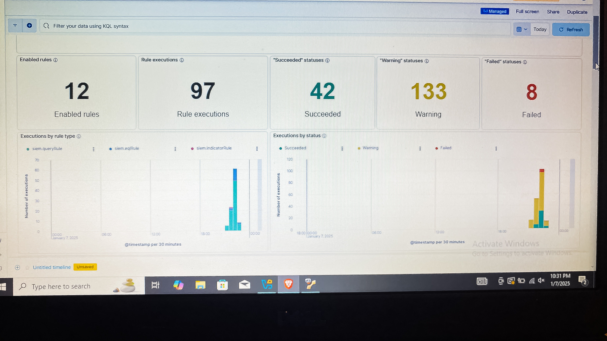

# elastic-stack-siem-lab
A cybersecurity project focused on configuring Elastic Stack SIEM to ingest, monitor, and analyze security events in real time. This lab included integrating Kali Linux, simulating incidents, analyzing event data, building dashboards and creating alert rules for proactive threat detection.

## **Project Overview**

In this project, I configured Elastic Stack SIEM to simulate, monitor, and analyze security events. I integrated Elastic with Kali Linux for real-time event ingestion, simulated various security incidents using tools such as Nmap, and created dashboards to visualize host and network activity. I also developed custom alert rules to automatically identify suspicious behavior and support incident response.

## **Key Activities Completed**

- Installed and configured Elastic Stack SIEM
- Integrated Kali Linux to generate host and network events
- Analyzed event logs using Elastic's Discover and Dashboard features
- Built dashboards to visualize alerts, rule executions, and event patterns
- Created detection rules for suspicious behavior and brute-force testing
- Tested rule accuracy and monitored rule execution performance
- Investigated alerts to understand attack patterns and system response

## **Screenshots**

### **1. Events View**
Displays captured security events within Elastic Stack, visualizing real-time data ingested from monitored systems and network activity.

### **2. Dashboard Overview**
Presents a centralized dashboard showing alert counts, severity distribution, rule execution success/failures, and event patterns.

### **3. Rule Performance**
Shows the total rule execution duration and percentile breakdowns for different detection rules. Used to evaluate rule performance, latency, and optimization opportunities.

## **Tools & Techniques**
- **Elastic Stack Components:**
    - Elasticsearch
    - Kibana
    - SIEM/Detection Engine

- **Security Tools:**
    - Kali Linux
    - Nmap scanning
    - Simulated attack traffic

- **Analysis Techniques:**
    - Event correlation
    - Log filtering using KQL
    - Dashboard creation
    - Alert rule development
    - Rule performance tuning

- **Cybersecurity Skills:**
    - Threat detection
    - Security event monitoring
    - Incident simulation
    - SIEM configuration

## **Purpose**

The purpose of this project was to build hands-on experience with SIEM operations, event monitoring, and cybersecurity analytics. By simulating attacks and monitoring them through Elastic Stack, I gained practical skills in threat detection, dashboard creation, correlation analysis, and alert configuration. This project demonstrates my ability to work with real-world SIEM tools and respond to security events effectively.